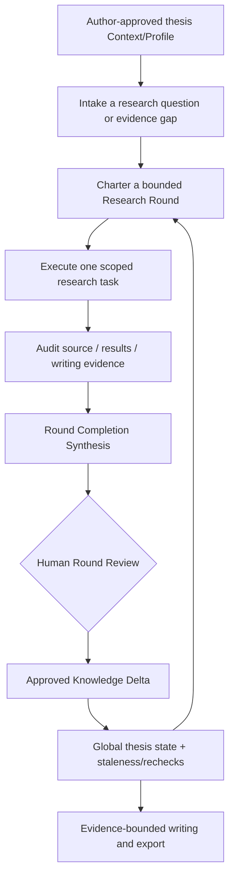

# Thesis Research Workflow — Evidence-first dissertation management

**A founder-led, research-focused ChatGPT Skill family under preparation.** The intended workflow tracks research questions, sources, claims, experiments, results, writing decisions and Human approvals as versioned artifacts instead of trusting old conversations.

[Tiếng Việt](README.vi.md) · [Features](docs/FEATURES.md) · [User guide](docs/USER_GUIDE.md) · [Hướng dẫn tiếng Việt](docs/USER_GUIDE.vi.md) · [12 prompts](docs/PROMPT_LIBRARY.vi.md) · [Synthetic example](examples/synthetic-context/README.md) · [Release status](docs/RELEASE_STATUS.md)

> **Release status: PUBLIC DOCUMENTATION PREVIEW.** This repository publishes workflow documentation and fictional examples, not an installable Skill bundle. RC6 matched ten installed Skills, but a sanitized distributable ZIP and an independent fresh-account canary remain pending.

## Why this approach?

A thesis project often spans sources, several chapters, experimental/modeling evidence, contradictory findings, external research services, human review, multiple languages and long AI sessions. A conventional chat transcript can lose decisions or promote weak observations into unsupported claims. The workflow addresses those problems with explicit source/version records, task scopes, Research Rounds, provenance and Human-owned knowledge promotion.

## Conceptual flow

**Key rule:** a specialist or agent completing a task never automatically closes a Research Round or promotes a scientific claim. Research Round closure and knowledge changes remain with the parent controller and require the appropriate Human decision.

## Main capabilities

- **Context bootstrap:** canonical thesis intake, table of contents, contribution/evidence map, method/data policy and writing-policy files.
- **Whole-thesis control:** one parent cursor, bounded Research Rounds, task contracts, synthesis and author review.
- **Literature discovery/audit:** source identity, metadata, evidence strength, version, DOI/locator and unresolved gaps.
- **Reference management:** stable B-IDs, claim-to-source/version links, bibliographic exports and stale-impact detection.
- **Scientific Debug:** compare golden vs failing experiments without mutating accepted data during diagnosis.
- **Writing governance:** chapter-scoped evidence freeze, consistency locks, terminology/formula registry and conservative claim language.
- **Language/export profiles:** preserve mathematics and approved meaning across review/translation/Word-ready outputs.
- **Continuity:** source-of-truth in canonical thesis artifacts, with repo memory only as a navigation/checkpoint layer.

See [FEATURES.md](docs/FEATURES.md) for which Skill owns each function, exact artifact names, assumptions and status.

## How a researcher would use it

Start with your own **author-controlled** documents, determine the research/evidence questions and create an approved Context Pack. Then ask the Thesis Lifecycle parent to intake one gap, plan a Research Round, delegate bounded work, compare the evidence, and prepare Human Round Review. Writing and translation occur only under approved scientific/evidence and language policy.

The [step-by-step Vietnamese guide](docs/USER_GUIDE.vi.md) includes safe prompts and an entirely synthetic illustration.

## Privacy and licensing

This candidate repo contains **documentation only** and must not be filled with an author's confidential experiments, unpublished papers, lab credentials, advisor communications, institutional records, private dissertation text or project memory. The present family includes internal and environment-dependent specialist components; portable distribution and legal licences require an independent release audit.

**HungLab** · [hunglab.xyz](https://hunglab.xyz) · [founder@hunglab.xyz](mailto:founder@hunglab.xyz)
